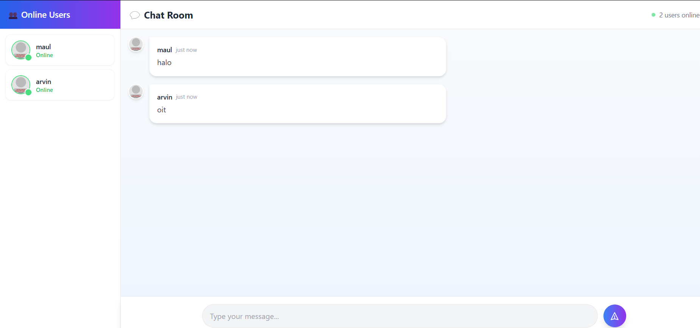

## Reflection Tutorial Modul 10

### Commit 1: 3.1 Original code
Contoh tampilan

### Commit 2: 3.2 Add some creativities to the webclient

- Saya merubah agar tampilannya terlihat lebih fresh (terwakilkan pada commit sebelumnya)
- Saya menambah fitur dimana jika user mengirim sebuah emoji maka emoji tersebut terlihat lebih besar.

Contoh tampilan

